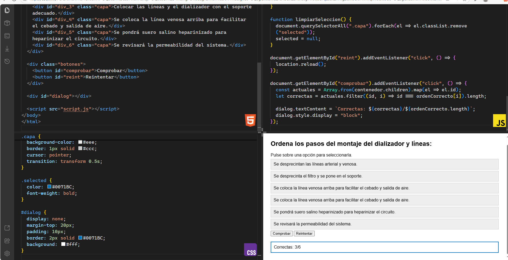
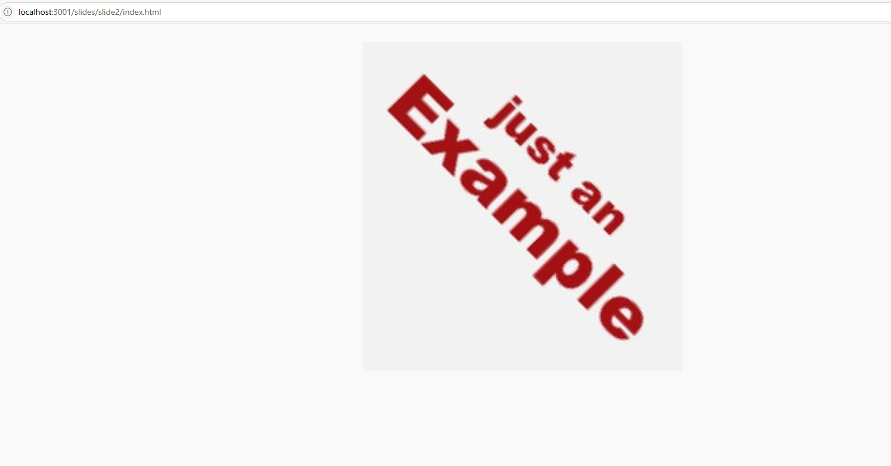
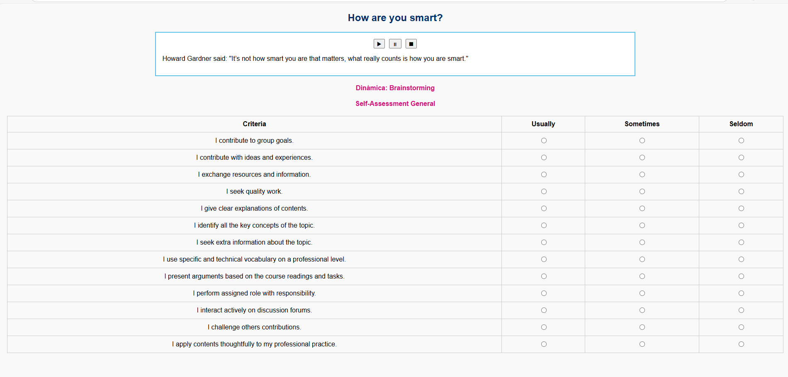
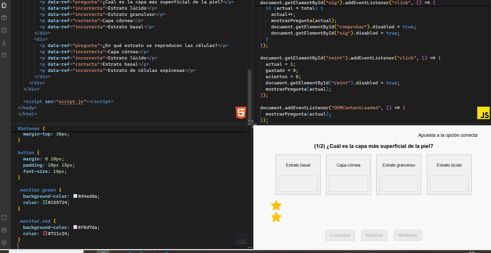
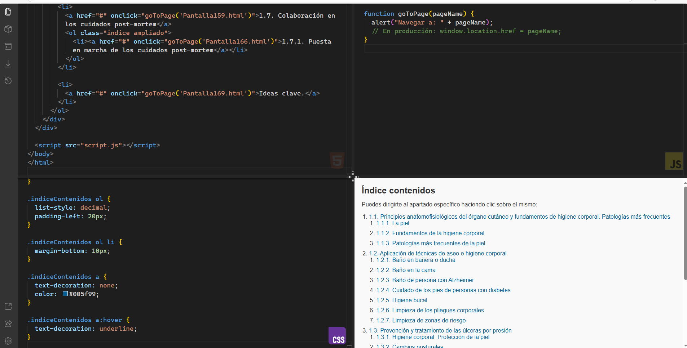
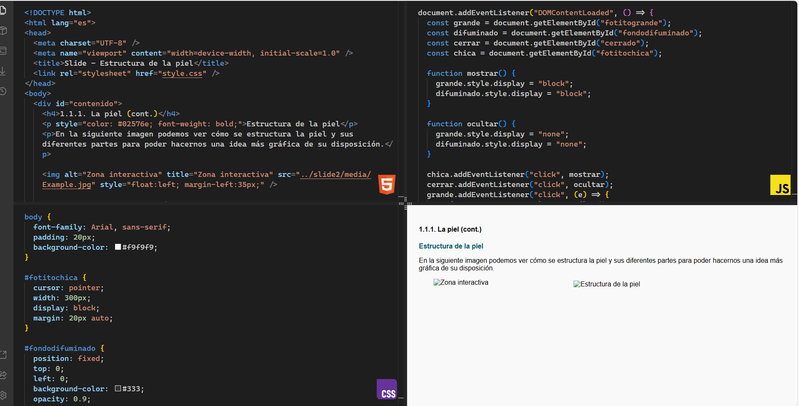

# 🌐 Proyecto Web: Conversión de Slide Interactivo

## 🧠 ¿Qué hace este proyecto?

Este proyecto muestra varias diapositivas (slides) interactivas convertidas desde una versión antigua que utilizaba jQuery, jQuery UI y plugins obsoletos.
Ahora, todo el comportamiento ha sido reescrito usando JavaScript moderno puro, sin depender de librerías externas ni frameworks.

Es una práctica de modernización de código ideal para aprender a migrar proyectos legacy y reutilizarlos en entornos actuales.

🔧 Reemplazo de jQuery, jQuery UI y plugins
Este proyecto reemplaza funcionalidades comunes de jQuery/jQuery UI usando únicamente JavaScript moderno. Aquí algunos ejemplos:

jQuery / Plugin original	Funcionalidad	Reemplazo en JS moderno
$(element).dialog()	Mostrar ventana emergente	<dialog> nativo o classList para mostrar/ocultar
$(element).draggable()	Arrastrar elementos	mousedown / mousemove / mouseup + style.transform
$(element).sortable()	Reordenar elementos	APIs de dragstart, dragover, drop
$(element).swap()	Intercambiar contenido	Función personalizada con replaceChild, etc.

🎬 Ejemplos de Slides Convertidos

📌 EJEMPLO SLIDE 1

📝 Descripción:

Actividad interactiva en la que el usuario debe ordenar 6 frases relacionadas con el contenido de la unidad.
Una vez ordenadas, puede hacer clic en el botón “Comprobar” para validar si el orden es correcto.
También se incluye un botón para reiniciar la actividad.

⚙️ Funcionalidad:

Arrastrar y soltar elementos para cambiar el orden.

Comprobación automática del orden correcto.

Mensaje de resultado (éxito o error).

Reinicio de la actividad.

📌 EJEMPLO SLIDE 2

📝 Descripción:

Actividad visual en la que se presenta una imagen ilustrativa (imagen de prueba) sobre el concepto de las inteligencias múltiples.
Al cargar la actividad, la imagen realiza una animación de rotación y escala para captar la atención del usuario.

⚙️ Funcionalidad:

Animación de rotación de la imagen (720°).

Animación de zoom desde escala 0 hasta escala 1.

Ejecución automática de la animación al iniciar el slide.

Propósito visual y motivacional como introducción al tema.

📌 EJEMPLO SLIDE 3

📝 Descripción:

Actividad interactiva en la que el usuario escucha una cita de Howard Gardner (audio de prueba) y reflexiona sobre el concepto de inteligencias múltiples.
Incluye una sección de brainstorming colaborativo, seguida de una autoevaluación personal con 13 criterios.
La actividad se considera completada una vez que el usuario ha respondido a todos los ítems.

⚙️ Funcionalidad:

Reproductor de audio con botones play, pause y stop.

Botones para mostrar u ocultar secciones.

Dinámica grupal con roles y objetivos.

Test interactivo de 13 ítems autoevaluables.

Validación automática (comprobación de que todos los ítems están marcados).

Mensaje de éxito animado con confirmación.

📌 EJEMPLO SLIDE 4

📝 Descripción:

Actividad interactiva tipo "Apuesta a la opción correcta", donde el usuario debe apostar monedas a las respuestas que considera correctas de una serie de preguntas.
Cada moneda representa una apuesta. Una vez apostadas, se puede comprobar el resultado. El ejercicio puede incluir varias preguntas, y al finalizar se muestra el número total de aciertos.

⚙️ Funcionalidad:

Presentación dinámica de preguntas y opciones:
Cada pregunta se muestra con un número (por ejemplo, (1/2)).
Se generan cuatro opciones visuales con una "pantalla" (monitor) y una "bandeja" debajo.
Las opciones se mezclan aleatoriamente cada vez gracias a la función shuffleElements.

Sistema de monedas para apostar:
Se crean monedas visuales (íconos) con un comportamiento drag and drop (arrastrar y soltar).
Cada moneda representa una apuesta que el usuario puede hacer colocándola en una bandeja debajo de una opción.
Solo cuando hay una moneda colocada en alguna opción, se activa el botón "Comprobar".

Validación de respuestas:
Al presionar el botón "Comprobar", se evalúan todas las monedas apostadas.
Si una moneda está sobre una opción correcta (data-ref="correcta"), se marca con color verde (.monitor.green).
Si está sobre una incorrecta (data-ref="incorrecta"), se marca con rojo (.monitor.red).
El número de monedas apostadas incorrectamente se suma a gastado y las correctas a aciertos.

Control de flujo del ejercicio:
El botón "Siguiente" (sig) permite pasar a la siguiente pregunta.
El botón "Reintentar" (reint) reinicia todo el ejercicio, reseteando las variables (actual, gastado, aciertos).

📌 EJEMPLO SLIDE 5

📝 Descripción:

Este slide funciona como un índice interactivo de contenidos del módulo formativo. El usuario puede consultar los temas y navegar directamente a cada pantalla haciendo clic sobre los títulos.

Está pensado para facilitar la navegación dentro del curso, permitiendo acceder fácilmente a los distintos apartados según su interés o necesidad.

⚙️ Funcionalidad:

Estructura jerárquica del índice:
El contenido está organizado en una lista numerada principal (<ol>) que representa las unidades temáticas.
Dentro de cada unidad, hay una sublista que muestra los puntos o pantallas específicas asociadas a ella (por ejemplo: 1.2.1, 1.2.2, etc.).
Esta organización es útil para seguir la progresión lógica del curso o volver fácilmente a un contenido ya estudiado.

Navegación con enlaces interactivos:
Cada ítem es un enlace (<a>) con un evento onclick que llama a la función goToPage().
Actualmente, la función muestra un alert() simulando la navegación, pero está preparada para que en producción utilice window.location.href para redirigir al archivo HTML correspondiente.

📌 EJEMPLO SLIDE 6

📝 Descripción:

Este slide permite al usuario ampliar una imagen ilustrativa de la estructura de la piel mediante un sistema de visualización interactiva.
Al hacer clic sobre la imagen pequeña, se muestra una versión grande centrada en pantalla con un fondo difuminado. El usuario puede cerrarla haciendo clic en un botón o fuera de la imagen.

⚙️ Funcionalidad:

Ampliación de imagen al hacer clic:
Hay una imagen más pequeña (#fotitochica) visible en el contenido.
Al hacer clic en ella, se muestra una versión ampliada centrada en pantalla (#fotitogrande) junto con un fondo opaco (#fondodifuminado) para resaltar la imagen.
Esto simula una especie de "visor de imagen" o lightbox.

Cierre de imagen ampliada:
Se puede cerrar de tres formas:
Haciendo clic en el botón #cerrado (ícono en la esquina).
Haciendo clic fuera de la imagen ampliada.
Redimensionando la ventana (se fuerza el cierre automático).

🧪 Todos los reemplazos fueron probados para asegurar el mismo comportamiento sin usar jQuery.

## 📁 Estructura del proyecto

/tu-proyecto
└── conversion_slides/
    ├── README.md                        # Documentación del proyecto
    ├── .gitignore
    ├── package.json
    ├── package-lock.json

    ├── slide1/                          # Slide 1: "Ejercicio interactivo de reordenación"
    │   ├── index.html
    │   ├── style.css
    │   ├── script.js
    │   └── media/
    │       └── multiple_intelligences.png

    ├── slide2/                          # Slide 2: Animación visual con transformación
    │   ├── index.html
    │   ├── style.css
    │   ├── script.js
    │   └── media/
    │       └── multiple_intelligences.png

    ├── slide3/                          # Slide 3: Autoevaluación interactiva
    │   ├── index.html
    │   ├── style.css
    │   ├── script.js
    │   ├── media/
    │   │   └── lapiz_amco.png
    │   └── resources/
    │       └── test-audio.mp3

    └── slide4/                          # Slide adicional
        ├── index.html
        ├── style.css
        ├── script.js
        └── media/
            └── ejemplo.png

## 🚀 Cómo usar

1. Clona este repositorio:

git clone https://github.com/MiriamVertice/conversion_slide.git
Abre index.html en tu navegador para probar el slide interactivo.

✅ Puedes usar Live Server en VS Code para ver los cambios automáticamente, o npm run start.

⚙️ Tecnologías utilizadas

HTML5

CSS3

JavaScript (ES6+)

📌 Objetivo del proyecto
Este proyecto es parte de una transición de código heredado con jQuery hacia una versión moderna y sostenible usando únicamente tecnologías nativas del navegador.

🧙‍♀️ Autora
Miriam Ibáñez Muñoz